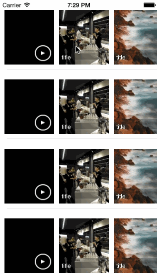

# SAScrollTableViewCell

[](http://cocoadocs.org/docsets/SAScrollTableViewCell)
[](http://cocoadocs.org/docsets/SAScrollTableViewCell)

## Purpose

An easy-to-use UITableViewCell subclass that implements a scrolling effect cell with media content such as images, video sound etc...  

##### Let's see example



## Usage

To run the example project; clone the repo, and run pod install from the Project directory first.

## How to use

import class `#import "SAScrollTableViewCell.h"` and add its delegate `SAScrollTableViewCellDelegate`.

Register class inside init or viewDidLoad method `[self.tableView registerClass:[SAScrollTableViewCell class] forCellReuseIdentifier:@"Cell"];`. Set height of cell to 140 in heightForRowAtIndexPath. 


```objc
- (UITableViewCell *)tableView:(UITableView *)tableView cellForRowAtIndexPath:(NSIndexPath *)indexPath {
    static NSString *const cellIdentifier = @"Cell";
    SAScrollTableViewCell *cell = [tableView dequeueReusableCellWithIdentifier:cellIdentifier];

    if (!cell) {
        cell = [[SAScrollTableViewCell alloc] initWithStyle:UITableViewCellStyleDefault reuseIdentifier:cellIdentifier];

    }

    cell.delegate = self;

    [cell setMedia:@[
                     [SAScrollMedia mediaWithType:SAMediaTypeVideoAsset
                                            title:@"title"
                                           object:[[NSBundle mainBundle] URLForResource:@"sample1" withExtension:@"mov"]],
                     [SAScrollMedia mediaWithType:SAScrollMediaTypeImageName title:@"title" object:@"sample1.jpg"],
                     [SAScrollMedia mediaWithType:SAScrollMediaTypeImageName title:@"title" object:@"sample2.jpg"],
                     [SAScrollMedia mediaWithType:SAScrollMediaTypeImageName title:@"title" object:@"sample3.jpg"]
                     ]];

    return cell;
}
```

### Adding media content:
`SAScrollTableViewCell` expects `SAScrollMedia` which holds each media content such as images, video and sound. Use factory method to create object `mediaWithType:(SAScrollMediaType)type title:(NSString *)title object:(id)object;`. At present only four media type are supported use the keys below:

```objc
typedef NS_ENUM(NSUInteger, SAScrollMediaType) {
    /**
     *  UIImage object
     */
    SAScrollMediaTypeImageObject,
    /**
     *  name of a file within main bundle i.e sample1.png
     */
    SAScrollMediaTypeImageName,
    /**
     *  NSData of a image
     */
    SAScrollMediaTypeRawImage,
    /**
     *  NSURL of a link to a video file supported by iOS
     */
    SAScrollMediaTypeVideoAsset,
    /**
     *  NSURL link of image on the web i.e http://lorempixel.com/250/250/
     */
    SAScrollMediaTypeImageURL
    /**
     *  for subclassing
     */
    SAScrollMediaTypeOther
};
```


## Requirements
iOS 7,
Portait only supported

## Installation

SAScrollTableViewCell is available through [CocoaPods](http://cocoapods.org), to install
it simply add the following line to your Podfile:

    pod "SAScrollTableViewCell"

## Author

shams ahmed, shamsahmed@me.com

## License

SAScrollTableViewCell is available under the MIT license. See the LICENSE file for more info.

